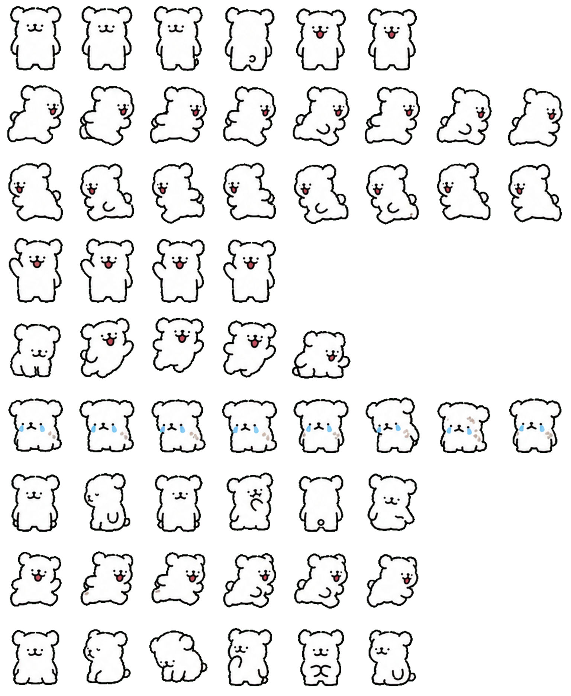

# Codex pets 宠物（线条小狗 Maltese & Golden Retriever）  

将 [Releases](https://github.com/dogovo/Codex-pets/releases) 下载的压缩包解压后放入`~/.codex/pets`目录，然后在ChatGPT(Codex) → 设置 → 宠物 中点击刷新并选择  
Extract the archive downloaded from [Releases](https://github.com/dogovo/Codex-pets/releases) and place it in the `~/.codex/pets` directory, then refresh the list and select it in ChatGPT (Codex) → Settings → Pets.  

在codex-pet.org中查看  
View more at codex-pet.org.  
[小白 Maltese](https://codex-pet.org/pets/xiaobai-webp/)  |  [小黄Golden Retriever](https://codex-pet.org/pets/xiaohuang-webp/)  

*图片由AI生成，有部分瑕疵*  
*Images are AI-generated and may contain minor imperfections.*  

## 小白(Maltese)  
**我们天下第一好~**  
  
## 小黄(Golden Retriever)  
**小鸡毛~**  
  
